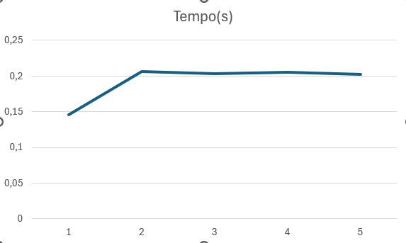
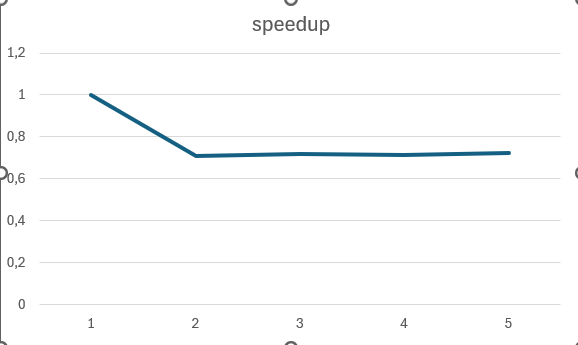
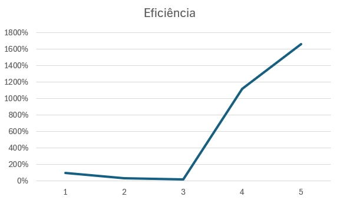

# soma_num
Relatório Soma de 10 milhões de numros
Disciplina: Paralelismo
 Aluno(s): Yan Lemos Santana Turma: Análise e Desenvolvimento de Sistemas 
Professor: Rafel 
Data: 13/03/2026
________________________________________
1. Descrição do Problema
Utilização de um software para leitura e soma de 10 milhões de números dentro de um arquivo TXT.
Foi utilizado um algoritmo em python na qual foi solicitado a soma desses números utilizando 2, 4, 8, 12 threads, a única entrada utilizada no software foi um arquivo TXT com 10 milhões de números.
O objetivo da implementação serve para diminuir o tempo de soma desses números.
O software tem uma complexidade média de cálculos.
Orientações para preenchimento
________________________________________
2. Ambiente Experimental
Foi utilizado um processador I5 de penúltima geração com 16gb de ram
Orientações
Informar as características do hardware e software utilizados na execução dos testes.
Item	Descrição
Processador	I5
Número de núcleos	24
Memória RAM	16gb
Sistema Operacional	windows
Linguagem utilizada	Python
Biblioteca de paralelização	Threading
Compilador / Versão	VS code
________________________________________
3. Metodologia de Testes
O tempo de execução foi medido com um comando dentro do código que registra o tempo do início da execução e o fim , foram realizadas 4 execuções, a media de tempo ficou entre 0,150 milésimos, a entrada foram 10 milhões de números.
•	1 thread/processo (versão serial)
0,146
•	2 threads/processos
0,206
•	4 threads/processos
0,203
•	8 threads/processos
0,205
•	12 threads/processos
0,202

________________________________________
4. Resultados Experimentais
Preencha a tabela com os tempos médios de execução obtidos.

Nº Threads/Processos	Tempo de Execução (s)
1	               0,146
2	0,206
4	0,203
8	0,205
12	0,202
________________________________________
5. Cálculo de Speedup e Eficiência
Fórmulas Utilizadas
Speedup
Speedup(p) = T(1) / T(p)
Onde:
•	T(1) = tempo da execução serial
•	T(p) = tempo com p threads/processos
Eficiência
Eficiência(p) = Speedup(p) / p
Onde:
•	p = número de threads ou processos
________________________________________
6. Tabela de Resultados
Preencha a tabela abaixo utilizando os tempos medidos.
Threds	Tempo(s)	speedup	Eficiência
1	0,146	1	100%
2	0,206	0,708738	35%
4	0,203	0,719212	18%
8	0,205	0,712195	1123%
12	0,202	0,722772	1660%

________________________________________
7. Gráfico de Tempo de Execução
  

---
________________________________________
8. Gráfico de Speedup

---
________________________________________
9. Gráfico de Eficiência

---
_____________
10. Análise dos Resultados
O speedup não foi próximo do ideal, a aplicação apresentou escalabilidade porém na execução de 4 thread  o sistema executou mais rápido que o de 8 threads, nunhum ponto caiu o tempo de execução, porém entre as threads a partir o de duas threads para baixo só foi diminuindo o tempo de execução, o numero de threads não utrapassam o numero fisico de nucleos. Acredito que não houve overhead.
Houve perda de desempenho ao usar threads, pela minha analise o software está demorando mais pela questão de somar primeiro com apenas um nucleo e depois com as threads solicitadas.
________________________________________
11. Conclusão
    Em termos tecnicos, apresentou ganhos significativamente de desempenho na soma, o melhor numeros de threads foi em 12, foi o que teve melhor desempenho durante os teste e o que menos apresentou instabilidade, o processo teve um escalonamento correto, tirando um pequeno desvio, porém em nenhum momento o tempo aumentou apenas diminuiu. O sistema ainda precisa de melhorias no calculo de tempo, para maior precisão!

